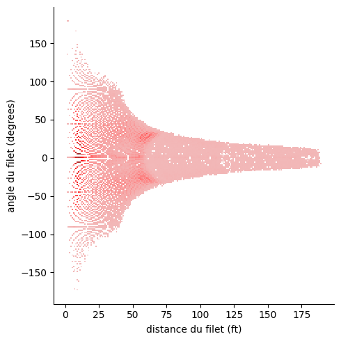
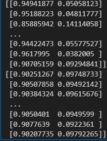
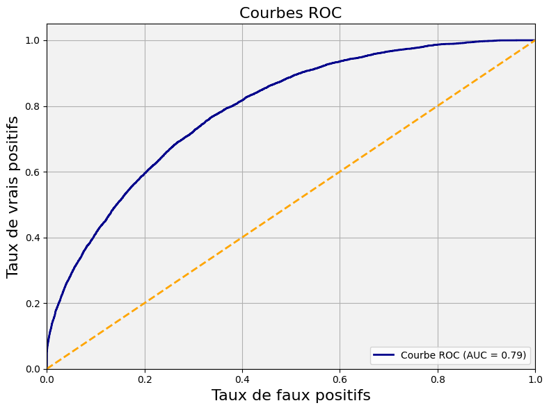

## 1: Introduction

Pour évaluer la performance en sport, les analystes utilisent les **buts attendus** (xG) pour mesurer la qualité des tirs. Contrairement à un simple décompte des buts ou tirs, cette mesure repose sur la **probabilité de réussite d’un tir** en fonction de caractéristiques spécifiques. Les données sont modélisées pour prédire la probabilité qu’un tir se traduise par un but, offrant ainsi un indicateur plus précis des chances de marquer.

---
## 2: Ingénierie des Caractéristiques I

### **2.1.Question 1:**

#### a) Histogramme de la Distance

La **Figure 2.1.1** illustre la distribution des tirs en fonction de leur distance par rapport au filet :

- La majorité des tirs sont effectués à moins de **65 pieds** du filet, avec un pic significatif près du filet.
- Les buts suivent une distribution logarithmique, avec une probabilité de réussite plus élevée pour les tirs à **moins de 25 pieds**.
- Au-delà de cette distance, bien que le nombre de tirs reste relativement élevé, la probabilité de marquer diminue de manière significative.
- Une longue queue est observée dans les distributions des tirs et des buts, traduisant des valeurs extrêmes rares mais existantes.


*Fig. 2.1.1 : Histogramme du nombre de tirs, regroupés par distance par rapport au filet.*

---

#### b) Histogramme de l’Angle

La **Figure 2.1.2** montre la distribution des tirs selon leur angle par rapport au filet :

- Les tirs et les buts suivent une distribution globale normale centrée autour de **0°** (en ligne droite vers le filet).
- Les tirs depuis le centre (0°) sont les plus fréquents et présentent un taux de réussite élevé.
- Les tirs pris sous des angles extrêmes (proches de ±40° ou plus) sont moins efficaces, avec moins de buts marqués.
- Des extremums locaux sont observés autour de **±40°**, traduisant une direction de tir préférée par certains joueurs. Cependant, cela ne se traduit pas par une augmentation significative des buts, révélant une faible efficacité pour ces tirs particuliers.


*Fig. 2.1.2 : Histogramme du nombre de tirs, regroupés par angle par rapport au filet.*

---
#### c) Histogramme 2D (Distance vs. Angle)

La **Figure 2.1.3** combine distance et angle dans un histogramme 2D, montrant leur relation dans les tirs et les buts :

- Les tirs les plus réussis sont concentrés près du centre du filet et à **moins de 50 pieds**.
- À des distances plus élevées, seuls les tirs centrés (angles proches de 0°) aboutissent à des buts.
- Les tirs pris à des distances et angles extrêmes sont beaucoup moins susceptibles de réussir, confirmant les observations des histogrammes de distance et d’angle.


*Fig. 2.1.3 : Relation entre la distance et l'angle de tir.*

D’autres alternatives pour les histogrammes 2D que nous avons représentés sont comme suit et peuvent également être adoptés pour l’analyse.


*Fig. 2.1.4 : Relation entre la distance et l'angle de tir.*


*Fig. 2.1.5 : Relation entre la distance et l'angle de tir.*

---
### **2.2.Question 2:**

### Taux de Buts en Fonction de la Distance

La **Figure 2.2.1** montre la relation entre le taux de buts et la distance par rapport au filet :

- **Proximité du filet** : Le taux de buts est **élevé à proximité immédiate du filet**, atteignant **100 %** pour les distances proches de 0 pied.  
- **Diminution avec la distance** : Le taux de réussite diminue rapidement à mesure que la distance au filet augmente.  
- **Tirs à longue distance (≥ 115 pieds)** : Une tendance intéressante est observée pour les tirs à longue distance, qui semblent être **disproportionnellement plus réussis** par rapport aux distances moyennes. Cette anomalie peut s'expliquer par plusieurs facteurs :  
  1. **Filet vide** : En fin de match, une équipe en retard peut retirer son gardien pour ajouter un attaquant supplémentaire, augmentant les chances de réussite des tirs lointains.  
  2. **Situations spéciales** : Tirs pendant un désavantage numérique ou dégagements conduisant à des buts inattendus.  
  3. **Artefacts dans les données** : 
     - Tirs mal classifiés ou enregistrés incorrectement.  
     - Tirs de longue distance qui surprennent les équipes adverses (bien que ce soit marginal).


*Fig. 2.2.1 : Taux de buts en fonction de la distance par rapport au filet.*

### Taux de Buts en Fonction de l’Angle

La **Figure 2.2.2** analyse le taux de buts en fonction de l’angle du tir par rapport au filet :

- **Angles entre -90° et 90°** :
  - Les tirs pris **de face (0°)** présentent un **taux de réussite plus élevé**, bien que limité.  
  - À mesure que l’angle augmente en valeur absolue, le taux de réussite diminue, confirmant que les tirs sous des angles larges sont moins efficaces.  
- **Angles extrêmes (≥ ±140°)** : Une tendance notable est observée :
  - Certains tirs pris depuis des angles extrêmes enregistrent un **taux de réussite de 100 %**.  
  - Explications possibles :
    1. **Tirs stratégiques** : Tirs intentionnels depuis derrière le filet, espérant des rebonds contre le gardien ou un autre joueur.  
    2. **Rebonds intentionnels** : Tirs calculés pour dévier de manière imprévisible.  
    3. **Filet vide** : Opportunités créées par une absence de gardien.  
    4. **Artefacts de données** : 
       - Mesures incorrectes ou saisies erronées des positions, entraînant des angles mal évalués.  


*Fig. 2.2.2 : Taux de buts en fonction de l'angle du tir par rapport au filet.*

---
## 3: Modèles de base
#### **3.1.Précision des modèles et biais potentiel:**

**Question 1 :**  
Lors de l’utilisation de la caractéristique `distanceFromNet`, le modèle de régression logistique atteint une précision d’environ **90,5 %** sur l’ensemble de validation, tandis qu’elle est légèrement supérieure, à **90,6 %**, en utilisant `angleFromNet` (voir Fig. 3.1.1). Cela signifie que dans environ **90 % des cas**, le modèle prédit correctement si un tir est un but ou non.

Cependant, une limitation importante émerge des valeurs prédites (`pred_probs`) renvoyées par la fonction `clf.predict_proba(X_val)`. La deuxième colonne des probabilités prédites, qui correspond à la probabilité qu’un tir soit un but (classe 1), montre une prédominance de faibles valeurs (Fig. 3.1.2). Ce comportement est révélateur d’un **biais du modèle** dû à un déséquilibre des classes dans les données : les tirs non réussis (classe 0) sont beaucoup plus fréquents que les buts (classe 1). Par conséquent, le modèle favorise la classe majoritaire pour maximiser la précision, au détriment des prédictions de la classe minoritaire.

Pour pallier ce problème, plusieurs approches peuvent être envisagées :
- **Rééchantillonnage** : Suréchantillonner les buts ou sous-échantillonner les tirs non réussis.
- **Rééquilibrage des données** : Pondérer les classes pour équilibrer leur importance.
- **Utilisation de métriques alternatives** : Privilégier le F1-score ou d’autres métriques adaptées aux ensembles déséquilibrés.
- **Modèles plus sophistiqués** : Explorer les arbres de décision, forêts aléatoires ou méthodes d’ensemble.


*Fig. 3.1.1 Précision des modèles de régression logistique*


*Fig. 3.1.2 Probabilités prédites des modèles de régression logistique*

#### **3.2.Analyse Comparative des Modèles (Questions 2 et 3):**

Trois classifieurs de régression logistique ont été évalués en utilisant :
1. La distance (`distance`),
2. L'angle (`angle`),
3. La combinaison de la distance et de l'angle (`distance + angle`).

Les performances des modèles sont analysées à travers plusieurs représentations graphiques :
#### 3.2.1. Comprendre les Représentations
Les courbes ROC sont couramment utilisées pour représenter les taux de vrais positifs (TP) en fonction des taux de faux positifs (FP) pour différents seuils de classification. Plus un modèle est performant (c’est-à-dire qu’il parvient à bien distinguer les deux classes, **no-Goal** et **Goal**), plus la courbe ROC se rapproche de la valeur 1 sur l’axe des ordonnées (représentant les vrais positifs). L’AUC (aire sous la courbe ROC) fournit une mesure globale de la performance du modèle sur l’ensemble des seuils de classification. Une AUC de 1,0 indique un modèle prédictif parfait. Les autres types de courbes, moins connues, seront expliqués dans les sections suivantes.


### A) Taux de Buts en Fonction du Centile de la Probabilité de Tir

Cette analyse permet d’évaluer comment les probabilités prédites par le modèle se traduisent en taux de buts réels pour différents segments de probabilité. L’objectif est d’examiner la fréquence des buts en fonction des centiles de la probabilité de but prédite. Les étapes de cette méthode sont les suivantes :

- Les probabilités de buts prédites sont divisées en centiles (par exemple, 10e, 20e, ..., 90e centile).
- Pour chaque centile, le **taux de buts** est calculé comme le nombre de buts divisé par le nombre total de tirs (buts et non-buts) dans ce segment.

Par exemple, si une probabilité de tir se situe dans le **70e centile**, cela signifie qu’elle est plus élevée que 70 % des autres probabilités de l’ensemble des données.

---

### B) Proportion Cumulée de Buts en Fonction du Centile de la Probabilité de Tir

Cette analyse mesure la capacité du modèle à capturer les buts les plus probables. Elle consiste à examiner **la proportion cumulative de buts observés** par rapport aux centiles de probabilité prédite :

- On cumule les buts en partant des probabilités les plus faibles jusqu’aux probabilités les plus élevées.
- Pour chaque centile, on calcule la **proportion des buts**, c’est-à-dire le nombre de buts cumulés divisé par le total des buts dans l’ensemble des données.

Par exemple, si **80 % des buts réels** sont capturés dans les **50 premiers centiles**, cela indique que les tirs avec les probabilités les plus faibles (les 50 % inférieurs) incluent une grande partie des buts observés.

---

### C) Diagramme de Fiabilité (Courbe de Calibration)

Le diagramme de fiabilité évalue si les probabilités prédites par le modèle correspondent aux probabilités observées dans les données. Voici comment il est construit :

- **Abscisse** : Les probabilités prédites, regroupées en intervalles (par exemple, 0.0-0.1, 0.1-0.2, etc.).
- **Ordonnée** : Le taux de réussite observé dans chaque intervalle de probabilité.

Un modèle bien calibré produit une courbe qui suit une ligne diagonale, indiquant une correspondance parfaite entre les probabilités prédites et les probabilités observées.

---

Ces analyses permettent de mieux comprendre les performances du modèle et son comportement vis-à-vis des probabilités qu’il génère.

---
#### 3.2.2. Interprétation des résultats

## Courbes ROC

Les courbes ROC permettent d’évaluer la capacité des modèles à distinguer entre les tirs réussis (*buts*) et non réussis (*non-buts*). En analysant la **Figure 3.3.1**, on constate que les modèles de régression logistique basés sur la caractéristique **distance au filet** (seule ou combinée avec l'angle) offrent une meilleure performance que ceux utilisant uniquement **l'angle**. 

- Les modèles basés sur la **distance** s'approchent davantage du coin supérieur gauche de la courbe ROC, atteignant une **AUC** d’environ **0,7** (respectivement 0,69 et 0,7).  
- En revanche, le modèle utilisant uniquement l'**angle** obtient une AUC de **0,50**, ce qui équivaut à une prédiction aléatoire. Cela suggère que l'**angle** n’est pas une caractéristique pertinente dans ce contexte.  

Même lorsque la **distance** et l'**angle** sont combinés, les performances restent comparables à celles obtenues avec la **distance seule**, confirmant ainsi que la distance est le facteur clé.


*Fig. 3.3.1 : Courbes ROC pour les modèles utilisant `distance`, `angle`, et `distance + angle`, comparées à une référence aléatoire.*

---
## Taux de Buts par Centile de Probabilité

La **Figure 3.3.2** illustre la fréquence des buts en fonction des centiles des probabilités prédites. Tracer le taux de buts par centile permet d’évaluer si le modèle favorise les tirs ayant des probabilités élevées dans certains centiles.

- La **référence aléatoire** est représentée par une ligne horizontale à **10 %**. Elle suppose une distribution égale des buts quelle que soit la probabilité.  
- Les modèles utilisant la **distance** ou **distance + angle** montrent une **tendance décroissante**. Cela indique qu’ils attribuent un taux de but plus élevé aux tirs ayant des scores de probabilité plus importants, démontrant ainsi leur bonne performance.  
- Les tirs associés à des probabilités élevées (selon ces modèles) se traduisent par des taux de réussite plus importants.

Comme pour les **courbes ROC**, ces modèles affichent des courbes quasi-identiques :  
- **Taux supérieur à la référence** pour les tirs appartenant aux centiles les plus élevés (≥70 %).  
- **Taux inférieur à la référence** pour les tirs appartenant aux centiles les plus bas, ce qui reflète leur capacité à identifier les tirs de meilleure qualité.  
Ces résultats confirment que la **distance** est une caractéristique essentielle pour prédire les buts.

En revanche, le modèle basé uniquement sur **l’angle** présente un comportement différent :
- Il affiche un taux de but légèrement plus élevé autour du **50e centile**, mais **sous-estime** les probabilités élevées.  
- Ses taux sont **irréguliers**, ce qui révèle une faible capacité à discriminer les tirs réussis des non-réussis.  
Ainsi, ce modèle n’est pas fiable pour estimer la probabilité de but et ne permet pas une forte séparation entre les deux classes.


*Fig. 3.3.2 : Centiles du modèle de probabilités de tir*

---

## Proportion Cumulative de Buts

La **Figure 3.3.3** illustre la proportion cumulative des buts par centile de probabilité prédite. Ce graphique permet d’évaluer la capacité des modèles à capturer efficacement les tirs les plus probables de se transformer en buts.

### Analyse des Courbes
- **Courbe cyan (« Distance et Angle du Filet »)** : Cette courbe démontre une **meilleure couverture des buts** dans les centiles supérieurs, ce qui confirme que ce modèle identifie efficacement les tirs ayant les probabilités les plus élevées de devenir des buts.  
- **Modèle basé uniquement sur l'angle** :  
  - Ce modèle attribue **moins de poids aux buts dans les centiles supérieurs** (probabilités >50 %).  
  - Par exemple, au **centile 50**, la courbe occupe moins de la moitié de l’aire, ce qui montre une couverture insuffisante des buts.  
  - La courbe est **presque linéaire**, ce qui indique une faible capacité à discriminer entre les tirs réussis et non réussis.  
- **Modèles basés sur la distance (seule ou combinée avec l’angle)** :  
  - Ces modèles montrent une **pente initiale abrupte**, ce qui reflète leur capacité à capturer rapidement une large proportion des buts.  
  - Par exemple, **50 % des buts** sont capturés dans les **30 % des centiles les plus élevés**, ce qui en fait des outils performants pour identifier les tirs les plus susceptibles de réussir.  


*Fig. 3.3.3 : Pourcentage Cumulatif de Buts.*

---
## Graphiques de Calibration

Les graphiques de calibration permettent de vérifier si les probabilités prédites par le modèle correspondent aux probabilités observées dans les données réelles. Une calibration idéale se traduit par une courbe suivant parfaitement la ligne diagonale (noire en pointillé), qui indique une correspondance parfaite entre les prédictions et les résultats observés.

### Analyse des Courbes
- **Courbe cyan (« Distance et Angle du Filet »)** :  
  - Ce modèle est **relativement bien calibré** pour les probabilités faibles et moyennes.  
  - Cependant, pour les probabilités élevées, on observe une **surestimation** des buts, ce qui suggère que des ajustements supplémentaires pourraient être nécessaires pour améliorer la calibration dans cette plage.  
- **Performance globale** :  
  - Parmi les options disponibles, le modèle combinant **distance et angle** est celui qui se rapproche le plus d’une calibration parfaite.  
- **Limites communes** :  
  - Les trois modèles se regroupent dans le coin inférieur gauche du graphique, avec une **fraction de positifs inférieure à 0,2**, ce qui reflète le faible nombre de buts par rapport au total des tirs.  
  - Aucun des modèles n’attribue une probabilité très élevée aux buts, ce qui peut être dû à la rareté relative des buts dans les données.


*Fig. 3.3.4.: Courbes de calibration pour les modèles de régression logistique entraînés avec la distance, l'angle, ou les deux (distance et angle), comparées à une référence aléatoire.*


#### **3.3.Suivi des Expériences Wandb (Questions 4 ): **

Les trois modèles ont été enregistrés dans Wandb. Voici les liens vers chaque modèle et les expériences associées :

#### Modèles Enregistrés sur Wandb
1. **Régression logistique entraînée uniquement sur la distance** :  
   [Lien vers le modèle](https://wandb.ai/thalia-cantero-udem/Milestone2_Q3/artifacts/model/log_reg_distance_model)  
2. **Régression logistique entraînée uniquement sur l'angle** :  
   [Lien vers le modèle](https://wandb.ai/thalia-cantero-udem/Milestone2_Q3/artifacts/model/log_reg_angle_model)  
3. **Régression logistique entraînée sur la distance et l'angle** :  
   [Lien vers le modèle](https://wandb.ai/thalia-cantero-udem/Milestone2_Q3/artifacts/model/log_reg_distance_angle_model)

---

#### Expériences Associées
1. **Expérience pour la régression logistique sur la distance** :  
   [Lien vers l’expérience](https://wandb.ai/thalia-cantero-udem/Milestone2_Q3/runs/e7oopxjt?nw=nwuserkhalidag)  
2. **Expérience pour la régression logistique sur l’angle** :  
   [Lien vers l’expérience](https://wandb.ai/thalia-cantero-udem/Milestone2_Q3/runs/3hlbqme8?nw=nwuserkhalidag)  
3. **Expérience pour la régression logistique sur distance + angle** :  
   [Lien vers l’expérience](https://wandb.ai/thalia-cantero-udem/Milestone2_Q3/runs/eoc7px60?nw=nwuserkhalidag)

---

## 4:Ingénierie des caractéristiques II
Au fil des étapes, nous avons conçu et extrait diverses caractéristiques pour enrichir notre modèle. Ces caractéristiques sont regroupées en quatre catégories principales :

#### 1. **Caractéristiques de base :**
- **`gameSeconds`** : Nombre total de secondes écoulées depuis le début du jeu (calculé à partir des données disponibles dans les fichiers JSON).
- **`emptynet`** : Indique si le tir a été effectué contre un filet vide (1) ou non (0).
- **`period`** : Période actuelle du jeu (1, 2 ou 3).
- **`coordinateX` et `coordinateY`** : Coordonnées de l’événement sur la patinoire (le centre de la patinoire étant défini comme (0,0)).
- **`distance`** : Distance en pieds entre le filet cible et l’endroit où le tir a eu lieu.
- **`angle`** : Angle en degrés entre le filet et l’endroit où le tir a eu lieu, mesuré depuis la perspective du gardien de but (un angle de 0° correspond à un tir directement devant le filet).
- **`shotType`** : Type de tir (ex. : slap shot, wrist shot).

#### 2. **Caractéristiques basées sur l’événement précédent :**
- **`lastEvent`** : Type d’événement immédiatement précédent ce tir (un parmi tous les événements possibles).
- **`lastCoordinateX` et `lastCoordinateY`** : Coordonnées (X, Y) de l’événement immédiatement précédent ce tir.
- **`timeLastEvent`** : Temps écoulé entre le tir actuel et l’événement immédiatement précédent (en secondes).
- **`lastDistance`** : Distance en pieds entre l’emplacement de l’événement précédent et celui du tir actuel.

#### 3. **Caractéristiques avancées :**
- **`rebound`** : Indique si l’événement précédent était également un tir (1) ou non (0).
- **`chang_angle`** : Si l’événement précédent était un tir, représente le changement d’angle entre les deux tirs.
- **`speed`** : Distance entre l’événement précédent et le tir actuel, divisée par le temps écoulé.
- **`vitesse_chang_angle`** : Si l’événement précédent était un tir, représente la vitesse de changement d’angle entre les deux tirs.

#### 4. **Caractéristiques bonus :**
- **`non_gardiens_amicaux`** : Nombre de patineurs alliés (hors gardien) présents sur la glace.
- **`non_gardiens_adverses`** : Nombre de patineurs adverses (hors gardien) présents sur la glace.
- **`temps_PP`** : Temps écoulé depuis le début du jeu de puissance (power play), exprimé en secondes.


---

### Illustrations des calculs

#### a) **`gameSeconds`** : 
Le calcul a été réalisé en déterminant les secondes totales écoulées par période de jeu.
```
# Calculer les secondes de jeu en fonction de la période et du temps dans la période
def calculate_game_seconds(row):
    minutes, seconds = map(int, row['periodTime'].split(':'))
    return (row['period'] - 1) * 1200 + minutes * 60 + seconds
```

#### b) **`distance` et `angle`** :
Les caractéristiques de distance et d’angle ont été calculées à partir des coordonnées des événements :

```
def calcul_distance_angle(df):
    # Initialiser la liste des distances et le dictionnaire des côtés défensifs par période pour chaque ligne
    distances = []
    angles = []
    home_defending_side_period = {1: None, 2: None, 3: None}
    angle = None
    distance = None

    # Boucler sur chaque ligne pour calculer les distances
    for index, row in df.iterrows():
        # Initialiser la distance à None pour chaque ligne
        
        # Extraire les informations pertinentes
        x = row['coordinateX']
        y = row['coordinateY']
        event_team_id = row['eventTeamId']
        home_team_id = row['teamHomeId']
        defending_side = row.get('homeTeamDefendingSide', None)
        zone_code = row.get('zoneCode', None)
        period = row.get('period', None)
        season = row.get('season', None)
        
        # Vérifier la saison et définir les conditions de calcul
        if zone_code is not None:
            if event_team_id == home_team_id and period in home_defending_side_period:
                if home_defending_side_period[period] is None:
                    home_defending_side_period[period] = 'right' if x > 0 else 'left'

            if zone_code == "D":
                if x > 0:
                    distance = math.sqrt((x + 89)**2 + y**2)
                    angle = np.arctan2(y, x+89)
                elif x < 0:
                    distance = math.sqrt((89 - x)**2 + y**2)
                    angle = np.arctan2(y, 89-x)

            elif zone_code == "O":
                if x > 0:
                    distance = math.sqrt((89 - x)**2 + y**2)
                    angle = np.arctan2(y, 89-x)
                elif x < 0:
                    distance = math.sqrt((x + 89)**2 + y**2)
                    angle = np.arctan2(y, x+89)

            elif zone_code == "N" and period in home_defending_side_period:
                if event_team_id == home_team_id:
                    if home_defending_side_period[period] == 'right':
                        distance = math.sqrt((x + 89)**2 + y**2)
                        angle = np.arctan2(y, x+89)
                    elif home_defending_side_period[period] == 'left':
                        distance = math.sqrt((89 - x)**2 + y**2)
                        angle = np.arctan2(y, 89-x)
                else:
                    if home_defending_side_period[period] == 'right':
                        distance = math.sqrt((89 - x)**2 + y**2)
                        angle = np.arctan2(y, 89-x)
                    elif home_defending_side_period[period] == 'left':
                        distance = math.sqrt((x + 89)**2 + y**2)
                        angle = np.arctan2(y, x+89)

        if angle is not None:
            angle = round(np.rad2deg(angle), 4)

        distances.append(distance)
        angles.append(angle)

    # Ajouter les distances calculées au DataFrame
    df['distance'] = distances
    # Ajouter les angles calculés au DataFrame
    df['angle'] = angles

    return df
```

#### c) **Caractéristiques basées sur l’événement précédent :**
Les calculs pour `lastCoordinateX`, `lastCoordinateY`, `lastEvent`, `timeLastEvent`, `lastDistance`, `rebound`, et `speed` ont été obtenus à l’aide des fonctions `get_distance` et `get_time_diff` définies comme suit :

```
for i in range(len(plays)):
    play = plays[i]
    if play["typeDescKey"] in ["shot-on-goal", "goal"]:
        last_details = plays[i-1].get("details", {}) if i > 0 else {}
        details = play.get("details", {})

```

```
        lastCoordinateX = last_details.get("xCoord", None)
        lastCoordinateY = last_details.get("yCoord", None)
        if lastCoordinateX is None:
            lastCoordinateX = 0
        if lastCoordinateY is None:
            lastCoordinateY = 0
        
        lastEvent = plays[i-1].get("typeDescKey", None)
        periodTime = plays[i].get("timeInPeriod", None)
        lastPeriodTime = plays[i-1].get("timeInPeriod", None)
        
        lastDistance = get_distance(coordinateX, coordinateY, lastCoordinateX, lastCoordinateY)
        timeLastEvent = get_time_diff(periodTime, lastPeriodTime)
        
        rebound = False
        rebound = lastEvent == "shot-on-goal"
        speed = lastDistance / timeLastEvent if timeLastEvent else 0

```
```
import numpy as np
import math

def get_distance(x1, y1, x2, y2):
    try:
        distance = math.sqrt((x2 - x1)**2 + (y2 - y1)**2)
    except:
        distance = 0
    return distance

```

```
# Get time difference
import datetime as dt

def get_time_diff(t1, t2):
    start_dt = dt.datetime.strptime(t1, '%M:%S')
    end_dt = dt.datetime.strptime(t2, '%M:%S')
    diff = (end_dt - start_dt)
    return diff.seconds

```

#### d) **Caractéristiques avancées :**
Les calculs pour `chang_angle` et `vitesse_chang_angle` sont illustrés ci-dessous :

```
import pandas as pd
import numpy as np

df3['chang_angle'] = 0  # Initialisez avec 0
df3['vitesse_chang_angle'] = 0  # Initialisez avec 0

# Boucle pour calculer le changement d'angle et la vitesse
for i in range(1, len(df3)):  # Commencez à 1 pour éviter les erreurs sur l'indice -1
    if df3.loc[i, 'rebound']:  # Si c'est un rebond
        angle_actuel = df3.loc[i, 'angle']
        angle_precedent = df3.loc[i - 1, 'angle']
        temps_ecoule = df3.loc[i, 'timeLastEvent']

        # Calcul du changement d'angle
        changement_angle = abs(180 - (angle_actuel + angle_precedent))
        df3.loc[i, 'chang_angle'] = changement_angle

        # Calcul de la vitesse du changement d'angle
        if temps_ecoule:
            df3.loc[i, 'vitesse_chang_angle'] = changement_angle / temps_ecoule
        else:
            df3.loc[i, 'vitesse_chang_angle'] = 0

```
---

### Bonus (Question 4):

Les caractéristiques bonus, telles que `non_gardiens_amicaux` et `non_gardiens_adverses`, ont été extraites à partir du champ `situationCode` des fichiers JSON. Voici la logique appliquée :
- **`non_gardiens_amicaux`** : Nombre de patineurs alliés (hors gardien) présents sur la glace.
- **`non_gardiens_adverses`** : Nombre de patineurs adverses (hors gardien) présents sur la glace.
- **`temps_PP`** : Temps écoulé en situation de power play.

---

###  Enregistrer le sous-ensemble filtré avec WandB (Question 5):

Un sous-ensemble des données, filtré pour inclure uniquement le match Winnipeg contre Washington du 12 mars 2018, a été enregistré dans WandB. Les caractéristiques finales incluent toutes les colonnes mentionnées ci-dessus.

**Lien vers l’expérience WandB :**  
[Visualisation des données pour Winnipeg vs Washington (12 mars 2018)](https://wandb.ai/thalia-cantero-udem/ingenieurie_char_data?nw=nwuserkhalidag)


## 5: Modèle avancés:

### Configuration et Analyse des Modèles XGBoost (Question 1):

#### a) Configuration d’entraînement/validation

**Données utilisées :**
- Les caractéristiques **distance** et **angle** ont été sélectionnées parmi les données d’entraînement (2016-2019).
- Les données ont été divisées en deux ensembles : **80 % pour l’entraînement** et **20 % pour la validation**.

**Modèle :**
- Le modèle utilisé est **XGBoost**, une méthode d’ensemble basée sur le boosting appliqué aux arbres de décision.
- Aucun réglage hyperparamétrique n’a été effectué : le modèle a été entraîné avec les paramètres par défaut.

**Résultats :**
Les performances des classifieurs XGBoost sont illustrées dans les figures suivantes :


*Fig. 5.1.1 Courbes ROC pour les caractéristiques distance, angle, et distance + angle.*


*Fig. 5.1.2 Taux de buts par percentile de probabilité de tir.*


*Fig. 5.1.3 Proportion cumulée de buts par percentile de probabilité de tir.*


*Fig. 5.1.4  Courbes de calibration des probabilités prédites.*

---
#### b) Analyse des Performances avec XGBoost 

XGBoost, configuré avec ses paramètres par défaut, montre des performances proches, voire légèrement supérieures à celles de la régression logistique en termes d'AUC, de taux de buts pour les percentiles les plus élevés, et de proportion cumulée de buts. La combinaison des caractéristiques distance et angle s'avère relativement plus bénéfique avec XGBoost.

**1. Courbe ROC/AUC**
- Le modèle XGBoost atteint une **AUC ≈ 0.70** lorsqu’il est entraîné sur la caractéristique **distance**, une valeur proche de celle obtenue avec la régression logistique (RL).  
- La combinaison **distance + angle** offre une légère amélioration (**AUC = 0.71**).  
- L’utilisation de l’**angle seul** donne une performance supérieure à la RL (**AUC ≈ 0.61** contre **0.51**).  

Ces résultats montrent que XGBoost améliore légèrement la capacité du modèle à différencier les tirs avec une forte probabilité de but.

**2. Taux de Buts vs Percentile de Probabilité**
- Les modèles XGBoost et RL attribuent des taux de buts similaires aux tirs appartenant aux percentiles supérieurs.  
- Dans les **10 % supérieurs**, les deux modèles atteignent un taux de réussite d’un peu plus de **20 %**, démontrant leur capacité à identifier les tirs de haute qualité.

**3. Proportion Cumulée de Buts vs Percentile de Probabilité**
- XGBoost identifie **50 % des buts réels** dans les **25 % des probabilités les plus élevées**, tandis que la RL nécessite un pourcentage légèrement plus grand.  
- Cela indique une **amélioration marginale** avec XGBoost pour distinguer les tirs de qualité.

**4. Courbes de Fiabilité (Calibration)**

- Les courbes de calibration de XGBoost sont **plus proches de la diagonale** que celles des modèles RL, indiquant une meilleure calibration des probabilités prédites.  

- Cependant, une **surestimation ou sous-estimation** subsiste pour les probabilités élevées.  

- Une plus grande variabilité est observée pour les événements de probabilité moyenne à élevée, suggérant un potentiel surajustement dans certains cas.  

---

#### c) Lien vers les Expériences WandB

Les expériences associées à ce modèle XGBoost sont accessibles aux adresses suivantes :
- **Distance uniquement** :  
  [Lien vers l’expérience](https://wandb.ai/thalia-cantero-udem/Milestone2_Q5/runs/y7581m7b?nw=nwuserkhalidag)  
- **Angle uniquement** :  
  [Lien vers l’expérience](https://wandb.ai/thalia-cantero-udem/Milestone2_Q5/runs/mxlpg9iu?nw=nwuserkhalidag)  
- **Distance + Angle** :  
  [Lien vers l’expérience](https://wandb.ai/thalia-cantero-udem/Milestone2_Q5/runs/br08psxf?nw=nwuserkhalidag)  

---
### Optimisation des Hyperparamètres (Question 2):

Pour entraîner un classificateur **XGBoost** avec toutes les caractéristiques créées dans la Partie 4, nous avons utilisé la méthode **RandomizedSearchCV()**, qui explore un sous-ensemble d’hyperparamètres possibles en validation croisée. Cette optimisation a permis de sélectionner les **meilleurs hyperparamètres** pour minimiser la perte logarithmique.

**Hyperparamètres explorés** :
1. **`max_depth`** : Profondeur maximale des arbres.
2. **`learning_rate`** : Taux d’apprentissage contrôlant la vitesse de convergence.
3. **`n_estimators`** : Nombre d’arbres.
4. **`gamma`** : Pénalisation des nouvelles divisions dans l’arbre.
5. **`reg_alpha`** : Régularisation L1 pour générer de la sparsité.
6. **`reg_lambda`** : Régularisation L2 pour éviter les surajustements.
7. **`subsample`** et **`colsample_bytree`** : Taux d’échantillonnage des données et des colonnes.

**Validation croisée** : Une validation croisée à **5 plis** a été utilisée pour trouver les hyperparamètres optimaux. Les plages explorées étaient :

| `n_estimators` | `max_depth` | `learning_rate` | `booster`   | `gamma` | `reg_alpha` | `reg_lambda` |
|----------------|-------------|-----------------|-------------|---------|-------------|--------------|
| 100            | 3           | 0.01            | 'gbtree'    | 0       | 0           | 0.5          |
| 200            | 6           | 0.05            | 'gblinear'  | 0.5     | 0.5         | 1            |
| 500            | 10          | 0.1             | 'dart'      | 1       | 1           | 5            |

**Meilleur modèle obtenu** :  

| `n_estimators` | `max_depth` | `learning_rate` | `booster` | `gamma` | `reg_alpha` | `reg_lambda` |
|----------------|-------------|-----------------|-----------|---------|-------------|--------------|
| 200            | 6           | 0.05            | 'gbtree'  | 0.5     | 0           | 5            |

*table 1: Exploration et sélection des hyperparamètres pour le modèle XGBoost via RandomizedSearchCV..*

Les performances de ce modèle optimisé sont illustrées dans les Figures 5.2.1-5.2.4.


*Fig. 5.2.1  Courbe ROC d'un classificateur XGBoost configuré par défaut, entraîné sur l'ensemble des caractéristiques créées, comparée à une ligne de base aléatoire.*


*Fig. 5.2.2  Taux de buts (# buts / (# tirs non convertis + # buts)) selon le percentile du modèle de probabilité de tir pour un classificateur XGBoost optimisé par recherche aléatoire avec validation croisée, entraîné sur l'ensemble des caractéristiques, comparé à une ligne de base aléatoire.*


*Fig. 5.2.3 Proportion cumulée des buts selon le percentile du modèle de probabilité de tir pour un classificateur XGBoost optimisé par recherche aléatoire avec validation croisée, entraîné sur l'ensemble des caractéristiques, comparée à une ligne de base aléatoire.*


*Fig. 5.2.4  Courbe de calibration d'un classificateur XGBoost optimisé par recherche aléatoire avec validation croisée, entraîné sur l'ensemble des caractéristiques créées dans la tâche 4, comparée à une ligne de base aléatoire.*

---

### Résultats

#### 1. Courbe ROC / AUC

- Le modèle optimisé atteint une **AUC de 0.79**, contre **0.71** pour le modèle baseline de XGBoost, indiquant une meilleure discrimination entre tirs convertis et non convertis.
- La courbe ROC est plus proche du coin supérieur gauche, reflétant une séparation plus efficace des classes.

#### 2. Taux de buts vs percentiles

- Le modèle assigné une **probabilité plus élevée aux tirs du 5e percentile supérieur**, atteignant un **taux de conversion d’environ 40 %** (contre 20 % pour le baseline).
- Cela indique une meilleure capacité à identifier les tirs à fort potentiel.

#### 3. Proportion cumulée des buts

- La courbe de proportion cumulée est **plus abrupte** dans les premiers percentiles, montrant que le modèle capte efficacement une grande partie des buts réels.
- À **50 % des probabilités**, le modèle capture environ **85 % des buts**, contre moins de **80 %** pour le baseline.

#### 4. Courbe de calibration

- Le modèle optimisé présente une **meilleure calibration**, les probabilités prédites correspondant mieux aux probabilités observées jusqu’à une probabilité moyenne prédite de 0.55 à 0.6.
- Toutefois, des fluctuations sont observées pour les probabilités élevées (supérieures à 0.7), ce qui pourrait bénéficier d’un ajustement supplémentaire.

---

### Lien vers l’expérience Wandb

- **Modèle enregistré** : [xgb_toutes_chars_grid_search1_model](https://wandb.ai/thalia-cantero-udem/Milestone2_Q5/artifacts/model/xgb_toutes_chars_grid_search1_model)  
- **Expérience associée** : [xgb_toutes_chars_grid_search1](https://wandb.ai/thalia-cantero-udem/Milestone2_Q5/runs/jfkxkm1w?nw=nwuserkhalidag)

---
### Comparaison des Performances et Sélection des Caractéristiques (Question 3):

#### Méthodes de sélection des caractéristiques

Quatre stratégies ont été utilisées pour simplifier les caractéristiques d’entrée :
1. **LASSO (LinearSVC)**  
2. **Élimination Récursive des Caractéristiques (RFE)**  
3. **Sélection univariée**  
4. **Seuil de variance**  

| Stratégie            | Accuracy | Score F1 | AUC   | Rappel | Nombre de caractéristiques |
|----------------------|----------|----------|-------|--------|-----------------------------|
| LASSO               | 0.91     | 0.139    | 0.785 | 0.076  | 15                          |
| RFE                 | 0.909    | 0.130    | 0.788 | 0.0713 | 10                          |
| Univariée           | 0.91     | 0.147    | 0.786 | 0.081  | 15                          |
| Seuil de variance   | 0.91     | 0.146    | 0.784 | 0.076  | 15                          |
| Baseline XGBoost    | 0.905    | 0.004    | 0.71  | 0.002  | 18                          |
*table 2: Comparaison des performances des stratégies de sélection des caractéristiques et du modèle baseline XGBoost.*

**Observations :**
Les meilleures performances pour les **méthodes de sélection des caractéristiques** (celles qui identifient des caractéristiques pertinentes et non redondantes) ont été obtenues en retenant **15 caractéristiques**. Une exception notable est la méthode **RFE (Recursive Feature Elimination)**, qui atteint des performances comparables avec seulement **10 caractéristiques**. Bien que sa performance soit légèrement meilleure avec 15 caractéristiques, l'avantage en termes de réduction de complexité rend la méthode RFE particulièrement intéressante.

Les performances de ces méthodes sont comparées au **baseline XGBoost**, qui utilise uniquement la distance et l'angle (rapporté également dans le tableau). 
Ci-dessous est la comparison en fonction des métriques :

#### **1. Précision :**
- Toutes les stratégies affichent une précision **très similaire (≈ 0.91)**, ce qui indique une **cohérence dans la prédiction correcte des classes**.

#### **2. AUC :**
- Les valeurs **AUC** se situent dans une plage étroite (**0.784–0.788**).  
- La méthode **RFE** obtient un léger avantage avec une AUC de **0.788**, indiquant qu'elle distingue mieux les classes positives et négatives.  
- En comparaison, le modèle baseline XGBoost a une AUC plus faible (**0.71**).

#### **3. Score F1 :**
- Le **score F1** est légèrement plus élevé pour la méthode **Univariée (0.147)**, reflétant une meilleure gestion des déséquilibres entre les classes.  
- Le modèle baseline XGBoost a un **score F1 extrêmement faible (0.009)**, indiquant une performance médiocre dans ce domaine.

#### **4. Rappel :**
- Le **rappel** est faible pour toutes les stratégies, mais il est le plus élevé pour la méthode **Univariée (0.081)**, ce qui signifie qu’elle détecte plus d’exemples positifs.  
- Le baseline XGBoost a le rappel le plus faible (**0.002**), ce qui limite sa capacité à capturer les vrais positifs.

---

####  Optimisation des Hyperparamètres avec GridSearch et Extraction du Meilleur Modèle

Suite à l'analyse précédente, la méthode **RFE (Recursive Feature Elimination)** a été utilisée pour réduire l’espace des caractéristiques et optimiser les hyperparamètres du modèle **XGBoost** via **GridSearch**. 

Le modèle résultant, combinant RFE et hyperparamètres optimisés, a été comparé au modèle baseline XGBoost.

Les performances des deux modèles sont résumées dans le tableau ci-dessous :

| Stratégie                        | Accuracy | Score F1 | AUC   | Rappel | Nombre de caractéristiques |
|----------------------------------|----------|----------|-------|--------|-----------------------------|
| Meilleur modèle XGBoost (RFE)   | 0.91     | 0.11     | 0.791 | 0.059  | 10                          |
| Baseline XGBoost                | 0.905    | 0.004    | 0.71  | 0.002  | 18                          |

*table 3: Comparaison des performances entre le meilleur modèle XGBoost optimisé avec RFE et le modèle baseline XGBoost* 
---
### Analyse des Résultats

1. **Performance améliorée** :  
   - Le meilleur modèle XGBoost avec RFE surpasse le baseline dans **toutes les métriques**.  
   - Avec une **AUC de 0.791**, il démontre une meilleure capacité à distinguer les tirs réussis des non-réussis.

2. **Réduction des caractéristiques** :  
   - Le modèle RFE conserve uniquement **10 caractéristiques**, tout en maintenant une performance supérieure.  
   - Cela suggère que certaines caractéristiques comme `{period, lastCoordinateX, lastDistance, coordinateX, chang_angle, rebound, gameSeconds, lastCoordinateY}` sont redondantes et non nécessaires pour une classification efficace.

3. **Robustesse du modèle** :  
   - Les courbes de performance obtenues (Figures 5.3.1-4) sont similaires à celles discutées dans la partie 5.2. Cela confirme la cohérence et la robustesse du modèle optimisé.


*Fig. 5.3.1 : Courbe ROC pour un modèle XGBoost avec RFE.*


*Fig. 5.3.2 : Taux de buts en fonction du percentile avec RFE.*


*Fig. 5.3.3 : Proportion cumulée des buts avec RFE.*


*Fig. 5.3.4 : Courbe de calibration avec RFE.*

---

### Lien vers l’expérience Wandb

- **Modèle enregistré** : [xgb-featsel-rfe-best-model-params](https://wandb.ai/thalia-cantero-udem/Milestone2_Q5/runs/xauvk3h1/artifacts)  
- **Expérience associée** : [xgb_Sel_chars_rfe_best_model_params](https://wandb.ai/thalia-cantero-udem/Milestone2_Q5/runs/xauvk3h1?nw=nwuserkhalidag)

---
## 6: Faites de votre mieux

## Analyse des Modèles et Optimisation des Hyperparamètres

### Méthodologie et Résultats

Plusieurs modèles ont été testés sur le même jeu de données pour identifier celui offrant les **meilleures performances**. 

Les résultats sont présentés avec et sans l'utilisation de la technique **SMOTE** (balancement des classes via sur-échantillonnage de la classe minoritaire).

---


### Modèles Testés

- **Réseaux de neurones**
- **Arbres de décision**
- **Forêts aléatoires**
- **Gradient Boosting** (LightGBM, XGBoost, CatBoost, Adaboost)
- **K-Nearest Neighbors (KNN)**
- **Support Vector Machine (SVM)**

### Méthodologie

#### 1. Sélection des Variables
- Les variables ont été sélectionnées soit intégralement, soit en fonction de leur importance, selon les méthodes de sélection de caractéristiques explorées dans la **partie 5.3**.
- Bien que ces méthodes aient permis de réduire le nombre de caractéristiques à un minimum de 10, il est clair que **distance**, **angle**, et **vitesse** sont les plus discriminantes.
- La méthode **RFE (Recursive Feature Elimination)** a été retenue car elle a donné les meilleurs résultats.

#### 2. Optimisation des Hyperparamètres
- Une recherche par validation croisée a été réalisée pour identifier les meilleurs **hyperparamètres**.
- Selon les besoins, une **GridSearch** (recherche par grille) ou une recherche **aléatoire** a été utilisée.
- Dans certains cas, le **parallélisme** a été exploité pour lancer plusieurs processus en parallèle, utilisant tous les cœurs logiques disponibles.

---
Les performances des modèles ont été mesurées selon plusieurs métriques :
- **Exactitude**
- **Score F1**
- **Rappel**
- **ROC AUC**
- **Proportion cumulée au 50e percentile**
- **Inflection du taux de buts**

Les **métriques clés** sont résumées dans le tableau ci-dessous :
- **% au 50e percentile cumulé** : Indique le percentile du modèle de probabilité de tir où 50 % des tirs sont cumulés.
- **Inflection du taux de buts** : Indique les taux de réussite maximum et minimum dans le 10e percentile supérieur (de 100 % à 90 %) pour évaluer la capacité du modèle à discriminer les tirs de "qualité".

#### Résultats (sans SMOTE)

| Modèle                                     | Exactitude | Score F1 | Rappel | ROC AUC | Proportion cumulée au 50e percentile | Inflection du taux de buts |
|-------------------------------------------|------------|----------|--------|---------|---------------------------------------|-----------------------------|
| Adaboost                                  | 0.909      | 0.13     | 0.073  | 0.78    | 83                                    | 42-31                       |
| CatBoost                                  | 0.91       | 0.118    | ---    | 0.789   | 83                                    | 47-34                       |
| CatBoost (GridSearch)                     | 0.91       | 0.133    | ---    | 0.791   | 84                                    | 48-35                       |
| XGBoost (GridSearch)                      | 0.905      | 0.114    | ---    | 0.79    | 84                                    | 45-33                       |
| XGBoost (GridSearch + sélection)          | 0.91       | 0.04     | ---    | 0.75    | 83                                    | 35-30                       |
| Forêt aléatoire                           | 0.916      | 0.294    | 0.175  | 0.778   | 82                                    | 53-21                       |
| Arbre de décision (GridSearch)            | 0.905      | 0.126    | 0.069  | 0.772   | 80                                    | 40-25                       |
| LightGBM                                  | 0.91       | 0.129    | ---    | 0.791   | 84                                    | 45-32                       |
| LightGBM (GridSearch)                     | 0.91       | 0.13     | ---    | 0.791   | 84                                    | 45-32                       |
| LightGBM (GridSearch + sélection)         | 0.905      | 0.03     | ---    | 0.76    | 82                                    | 36-31                       |
| SVM                                       | 0.68       | 0.27     | 0.617  | 0.714   | 54                                    | 22-12                       |
| KNN                                       | 0.896      | 0.05     | ---    | 0.554   | 56                                    | 18-15                       |
| Réseau de neurones                        | 0.33       | 0.18     | 0.75   | 0.54    | 81                                    | 39-21                       |

---

### Résultats (avec SMOTE)

| Modèle                                     | Exactitude | Score F1 | Rappel | ROC AUC | Proportion cumulée au 50e percentile | Inflection du taux de buts |
|-------------------------------------------|------------|----------|--------|---------|---------------------------------------|-----------------------------|
| Adaboost                                  | 0.906      | 0.156    | 0.09   | 0.75    | 84                                    | 43-32                       |
| Forêt aléatoire (GridSearch)              | 0.916      | 0.296    | 0.177  | 0.788   | 84                                    | 57-23                       |
| Forêt aléatoire                           | 0.8995     | 0.22     | 0.152  | 0.7452  | 82                                    | 37-19                       |
| Arbre de décision (GridSearch)            | 0.909      | 0.133    | 0.073  | 0.772   | 83                                    | 40-22                       |
| SVM                                       | 0.69       | 0.18     | 0.59   | 0.73    | 56                                    | 24-14                       |
| Réseau de neurones                        | 0.83       | 0.464    | 0.42   | 0.77    | 82                                    | 43-26                       |

---
### Analyse des Meilleurs Modèles
#### **1. Réseaux de Neurones**
- Modèle adopté : **Keras Sequential** avec trois couches de 2014 neurones et deux couches dropout de 1024 neurones, entraîné pendant 100 époques avec une taille de lot de 2048.

- Performances remarquables après l’incorporation de **SMOTE** :
  - **Score F1** : 0.464
  - **Rappel** : 0.42
  - **ROC AUC** : 0.77
- Limites : Instabilité des résultats et reproductibilité non assurée via des simulations multiples.

#### **2. Forêt Aléatoire (GridSearch)**
- Performances solides sans optimisation.
- Atteint l'un des scores F1 les plus élevés (0.296).
- Distinction efficace des tirs de qualité, notamment dans le top 10 % des tirs.

---

### Meilleurs Modèles

1. **LightGBM (meilleurs hyperparamètres)**
   - Meilleur **AUC** et **F1-Score**.
   - Excellente calibration.

2. **XGBoost (meilleurs hyperparamètres)**
   - Deuxième position pour **AUC** et **F1-Score**.
   - Calibration compétitive.

3. **LightGBM (sans optimisation des variables)**
   - Performances légèrement inférieures à la version optimisée, mais solides.

4. **XGBoost (sans optimisation des variables)**
   - Similaire à LightGBM sans optimisation.
---


*Fig. 6.1.1 : : Comparaison de plusieurs modèles par la courbe ROC.*


*Fig. 6.1.2 : : Comparaison des scores F1 pour LightGBM et XGBoost.*


*Fig. 6.1.3 : Comparaison des courbes ROC de LightGBM  direct, avec optimisation GridSearch et avec sélection de caractéristiques et optimisation GridSearch.*


*Fig. 6.1.4 : Comparaison des courbes ROC de XGBoost  direct, avec optimisation GridSearch et avec sélection de caractéristiques et optimisation GridSearch.*

### Comparaison des Modèles

- **LightGBM** : Supérieur en AUC et calibration.
- **KNN et Arbres de Décision** : Performances plus faibles en raison d'une flexibilité limitée.
- **CatBoost** : Bonnes performances, mais derrière LightGBM et XGBoost.
- **Sélection des caractéristiques/PCA** : Performances inférieures aux modèles utilisant toutes les caractéristiques.
- **SMOTE** : Amélioration générale des performances.

---
### Défis et Enseignements

- **Importance des caractéristiques** : La sélection des caractéristiques a eu un impact significatif sur les modèles de type boosting.
- **Variables catégorielles** : L'ajout de variables comme *shotType* a amélioré les performances.
- **Optimisation des hyperparamètres** : Joue un rôle clé dans la sélection des meilleurs modèles.
---

### Liens vers les Expériences Wandb

#### LightGBM
- [Meilleurs hyperparamètres](https://wandb.ai/thalia-cantero-udem/IFT6758.2024-A04/runs/n20zwdrd?)
- [Modèle de base](https://wandb.ai/thalia-cantero-udem/IFT6758.2024-A04/runs/vkno89an?)

#### XGBoost
- [Meilleurs hyperparamètres](https://wandb.ai/thalia-cantero-udem/IFT6758.2024-A04/runs/x2j52zwi?)
- [Modèle de base](https://wandb.ai/thalia-cantero-udem/IFT6758.2024-A04/runs/5ocbkw47?)
- [Avec sélection de caractéristiques](https://wandb.ai/thalia-cantero-udem/Milestone2_Q5/runs/xauvk3h1?nw=nwuserkhalidag)

#### Réseaux de Neurones
- [Expérience Wandb](https://wandb.ai/thalia-cantero-udem/Milestone2_Q6/runs/fl4vck4j)

---
## 7:  Évaluer sur l'ensemble de test:

### Questions 7.1-2

Les résultats ci-dessous (Figures 7.1.1-4) montrent les performances des modèles précédemment discutés : 
- **Régression Logistique basée sur la distance uniquement (LR_D)**, 
- **Régression Logistique basée sur l’angle uniquement (LR_A)**,
- **Régression Logistique basée sur la distance et l’angle (LR_DA)**,
- **XGBoost (XGB)**,
- **LightGBM (modèle ayant obtenu les meilleures performances dans la partie 6)**.

Le jeu de données de test est celui associé à la saison régulière 2020/2021.

### Observations

#### Performances globales
Comme illustré dans la figure 7.1.1, le modèle **LightGBM** subit une légère baisse d'une unité en termes d'AUC sur les courbes ROC, comparé aux performances obtenues lors de la validation. Les autres modèles, quant à eux, maintiennent leurs performances inchangées.

Cette stabilité des résultats suggère que les modèles possèdent une bonne capacité de généralisation ou que le jeu de test est relativement simple comparé à l’ensemble d’entraînement. Les modèles basés sur des arbres (**XGBoost** et **LightGBM**) affichent les meilleurs scores AUC (0.78), dépassant nettement ceux des modèles de régression logistique, qui se basent sur des relations linéaires.

Cela dit, le gap les performances des modèles de régression logistique (**LR_D** et **LR_DA**) et celles des méthodes d’ensemble à base d’arbres reste acceptable. Ce constat est d’autant plus notable que les modèles de régression logistique s’appuient sur un nombre limité de caractéristiques, soulignant ainsi la forte capacité discriminante de la caractéristique « distance ».


*Fig. 7.1.1 : Courbes ROC des modèles développés, évalués sur le jeu de données de la saison régulière 2020/2021*

### Performance en termes de taux de réussite des buts selon le percentile du modèle

La performance relative au taux de réussite des buts, en fonction des percentiles de probabilité des modèles, montre des variations plus prononcées et un bruit accru sur les données de test.

- **LR_D** : La courbe affiche une décroissance rapide. Les tirs dans les percentiles élevés (près de 100 %) présentent un taux de réussite satisfaisant, mais ce taux diminue rapidement pour les percentiles inférieurs. Cela suggère que ce modèle identifie relativement bien les tirs "de qualité", mais perd en précision pour les tirs moins probables.

- **LR_A** : La courbe est plus irrégulière, avec des taux de réussite globalement plus faibles. Surprenant, les tirs avec des percentiles plus faibles présentent parfois un taux de réussite supérieur à ceux dans les percentiles élevés. Cela montre que l'angle, en tant que caractéristique isolée, est moins pertinent pour prédire les succès des tirs.

- **LR_DA** : La courbe est similaire à celle de LR_D, ce qui indique que l'ajout de l'angle n'améliore pas significativement la performance par rapport à l'utilisation de la distance seule.

- **XGB et LightGBM** : Le 10 % supérieur des percentiles affiche un taux de réussite élevé (autour de 70 %). Cela témoigne d'une meilleure généralisation de ces modèles, probablement grâce à leur capacité à capturer des relations non linéaires complexes.


*Fig. 7-1-2 : Taux de buts (% de buts sur le total des tirs) en fonction du percentile du modèle de probabilité de tir pour les modèles développés, testés sur le jeu de données de la saison régulière 2020/2021
*


Cette courbe ROC compare les performances de cinq modèles pour prédire les buts :

- **LR_D** (régression logistique avec distance) et **LR_DA** (régression logistique avec distance et angle) ont une AUC modérée de **0,70**, indiquant une capacité correcte à discriminer les classes.
- **LR_A** (régression logistique avec angle) affiche une AUC faible de **0,51**, suggérant une performance proche du hasard.
- Les modèles **XGBoost** et **LightGBM** se distinguent avec une AUC de **0,78**, montrant une meilleure capacité prédictive.

En résumé, les modèles basés sur des arbres (**XGBoost** et **LightGBM**) surpassent les régressions logistiques, en particulier celle basée uniquement sur l'angle.


### Analyse des courbes de proportion cumulative et de calibration

#### Proportion cumulative des buts (Figure 7.1.3)

La courbe **7.1.3** présente la proportion cumulative de buts en fonction des percentiles des probabilités de tir prévues par différents modèles. Ces courbes varient très peu par rapport à l’étape de validation, ce qui reflète la robustesse des modèles, leur capacité de généralisation et la similitude dans la distribution des données d’entraînement et de test.

- **Modèles LR_D et LR_DA** : Les modèles basés sur la distance seule (LR_D) et sur la combinaison distance + angle (LR_DA) se comportent de manière similaire. Ils capturent efficacement une proportion significative des buts dans les percentiles les plus élevés (>90 %).

- **Modèle LR_A** : Ce modèle, basé uniquement sur l’angle, présente une courbe beaucoup plus plate, indiquant une faible capacité à discriminer les tirs ayant une forte probabilité de réussite.

- **XGBoost et RF** : Ces modèles sont les plus performants. Leurs courbes, plus pentues, montrent qu’ils capturent rapidement une grande proportion des buts dans les percentiles les plus élevés (100-90 %). Cela illustre leur capacité à attribuer des scores élevés aux tirs ayant une forte probabilité de succès.


*Fig. 7-1-3 : Proportion cumulative des buts en fonction du percentile du modèle de probabilité de tir pour les modèles développés, testés sur le jeu de données de la saison régulière 2020/2021
*
---

#### Courbes de calibration (Figure 7.1.4)

La figure **7.1.4** illustre les courbes de calibration, qui évaluent la correspondance entre les probabilités prédites par les modèles et les fractions réelles de positifs (buts).

- **LR_D, LR_A et LR_DA** : Les régressions logistiques montrent une bonne calibration pour les probabilités très faibles (inférieures à 0.2), mais dévient significativement pour les probabilités plus élevées. Cela limite leur précision pour les prédictions de haute probabilité.
- **XGBoost et LightGBM** : Ces modèles affichent une calibration quasi parfaite jusqu’à des probabilités de 0.4. Toutefois, des oscillations importantes apparaissent pour les probabilités élevées, révélant des problèmes de calibration à ces niveaux.

Ces problèmes de calibration, particulièrement pour les probabilités élevées, avaient déjà été observés lors de la phase de validation.


*Fig. 7-1-4 : Courbes de calibration pour les modèles développés, testées sur le jeu de données de la saison régulière 2020/2021
*
